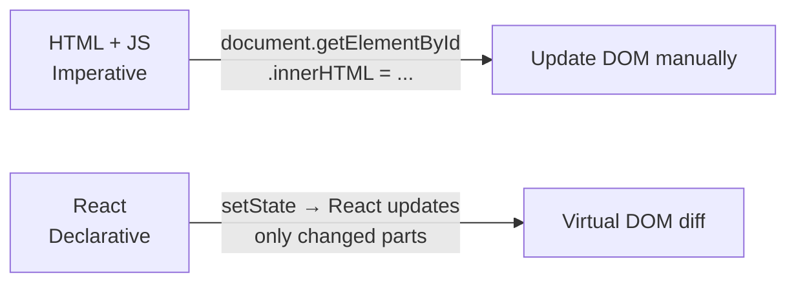

# โครงสร้าง React + ตั้งค่า Vite + TypeScript <Badge type="info" text="TPQI 10302" />

> **บทนี้เตรียมอะไร:** ติดตั้ง React + TypeScript + Vite และอ่านโครงสร้างโปรเจกต์ — ใช้จริงตลอดทั้ง course

## 🎯 M: Motivation

::: danger 🚨 ปัญหาจากโปรเจกต์ (PjBL Hook)
**ระบบเบิก-จ่ายอุปกรณ์ไอที** ของโรงเรียนยังใช้กระดาษบันทึก ไม่รู้ว่าอุปกรณ์ถูกยืมไปแล้วหรือยัง วิชานี้จะสร้างเว็บแอปแก้ปัญหานี้ด้วย React + TypeScript + Vite
:::

> 💡 **เปรียบเทียบ:** React Component เหมือน "แบบฟอร์มสำเร็จรูป" — ออกแบบครั้งเดียว ใช้ซ้ำได้หลายครั้ง ข้อมูลต่างกันได้

## 📖 I: Information

| เครื่องมือ | หน้าที่ | เปรียบเทียบ |
| :--- | :--- | :--- |
| **React** | สร้าง UI แบ่งเป็น Component ย่อย | LEGO — ต่อบล็อกชิ้นเล็กๆ เป็นหน้าเว็บ |
| **TypeScript** | เพิ่ม Type Safety ให้ JavaScript | Spell checker — แจ้งเตือนก่อน Error จริง |
| **Vite** | Build tool เร็วมาก มี Hot Reload | ดู preview แบบ real-time ทันทีที่บันทึก |

### React แก้ปัญหาอะไร

HTML + JavaScript แบบเก่าต้องเลือก element แล้วแก้เองทุกครั้ง (Imperative) — React บอกแค่ "UI ควรเป็นยังไง" แล้วจัดการให้เอง (Declarative)



HTML + JS ต้องสั่ง "ไปหา element นั้น แล้วเปลี่ยนค่านี้" — React แค่บอก "ถ้า isAvailable เป็น true ให้แสดงปุ่มนี้" แล้ว React จัดการ DOM เอง

### Virtual DOM (conceptual)

React เก็บ "สำเนา" ของ DOM ไว้ใน memory เรียกว่า Virtual DOM เมื่อ state เปลี่ยน React เปรียบเทียบ Virtual DOM เก่ากับใหม่ แล้วอัปเดต DOM จริงเฉพาะส่วนที่เปลี่ยน

```
① setStatus('borrowed')
    ↓
② React สร้าง Virtual DOM ใหม่
    ↓
③ เปรียบเทียบ (diff) กับ Virtual DOM เก่า
    ↓
④ อัปเดต DOM จริงเฉพาะ badge สถานะ — ส่วนอื่นไม่กระทบ
```

> 💡 นี่คือเหตุผลที่ React เร็วและทำไม key ใน `.map()` สำคัญ — React ใช้ key ระบุว่า item ไหนเปลี่ยนไป

### ขั้นตอนที่ 1 — สร้างโปรเจกต์ใหม่

```bash
npm create vite@latest my-equipment-system -- --template react-ts
cd my-equipment-system
npm install
npm run dev
```

Terminal จะแสดงผล:

```
  VITE v5.x  ready in 500ms
  ➜  Local:   http://localhost:5173/
```

เปิด Browser ที่ `http://localhost:5173/` → เห็นหน้า React ตัวอย่าง ✅

### ขั้นตอนที่ 2 — โครงสร้างโฟลเดอร์

โปรเจกต์ระบบเบิก-จ่ายอุปกรณ์ไอทีจะมีโครงสร้างนี้เมื่อเพิ่มโค้ดครบ wk7:

```
src/
├── components/          ← UI ย่อย ใช้ซ้ำได้
│   ├── Navbar.tsx
│   └── ProtectedRoute.tsx
├── context/             ← Global state (wk5)
│   ├── AuthContext.ts
│   └── AuthProvider.tsx
├── hooks/               ← Custom Hooks (wk2-3)
│   ├── useAuth.ts
│   └── useEquipments.ts
├── pages/               ← หน้าหลักแต่ละ route (wk7)
│   ├── LoginPage.tsx
│   ├── EquipmentPage.tsx
│   └── AdminPage.tsx
├── types/               ← TypeScript Interfaces (wk2)
│   └── index.ts
├── api/                 ← Axios calls (wk4)
│   └── equipmentApi.ts
├── App.tsx              ← Routes + layout
└── main.tsx             ← Entry point
```

::: tip 💡 wk1 ตอนนี้
ยังมีแค่ `App.tsx` กับ `main.tsx` — โฟลเดอร์อื่นจะสร้างเพิ่มทีละ wk
:::

### Naming Convention — กฎสากลที่ต้องใช้ทั้ง course

| รูปแบบ | ใช้สำหรับ | ตัวอย่าง |
| :--- | :--- | :--- |
| `PascalCase` | Component, Interface, Type, Props | `EquipmentCard`, `Equipment`, `EquipmentCardProps` |
| `camelCase` | variable, function, hook | `equipments`, `handleBorrow`, `useAuth` |
| `handle` prefix | Event handler | `handleSubmit`, `handleBorrow`, `handleDelete` |
| `is/has` prefix | Boolean state | `isLoading`, `isAuthenticated`, `hasError` |
| `use` prefix | Custom Hook เท่านั้น | `useAuth`, `useEquipments` |

**กฎไฟล์:**
- Component → `PascalCase.tsx`: `EquipmentCard.tsx`, `LoginPage.tsx`
- Hook → `camelCase.ts`: `useAuth.ts`
- Type/util → `camelCase.ts`: `index.ts`, `api.ts`

::: code-group
```ts [✅ ถูกต้อง]
export function EquipmentCard() {}    // Component → PascalCase
const isLoading = false               // boolean → is prefix
function handleBorrow(id: number) {}  // event handler → handle prefix
```
```ts [❌ ผิด]
export function equipmentcard() {}    // ❌ Component ต้องเป็น PascalCase
const loading = false                 // ❌ boolean ควรขึ้นต้น is/has
function borrow(id: number) {}        // ❌ event handler ควรขึ้นต้น handle
```
:::

### Named vs Default Export

| | Named Export | Default Export |
| :--- | :--- | :--- |
| syntax | `export function Card()` | `export default function App()` |
| import | `import { Card } from './Card'` | `import App from './App'` |
| ชื่อตอน import | ต้องตรงกัน | ตั้งชื่อได้เอง |
| กฎของโปรเจกต์นี้ | Component/Hook/Type ทั้งหมด | `App.tsx` เท่านั้น |

### React.FC vs function declaration

::: code-group
```tsx [✅ ใช้ใน course นี้]
export function EquipmentCard({ name }: EquipmentCardProps) {
  return <div>{name}</div>
}
```
```tsx [❌ React.FC — style เก่า ไม่แนะนำ]
const EquipmentCard: React.FC<EquipmentCardProps> = ({ name }) => {
  return <div>{name}</div>
}
```
```tsx [💡 ทำไม function declaration ดีกว่า]
// อ่านง่ายกว่า / TypeScript error ชัดกว่า / hoisting ดีกว่า
// ถ้าเจอ React.FC ใน tutorial เก่า → แปลงเป็น function declaration
```
:::

### ขั้นตอนที่ 3 — อ่าน main.tsx

::: code-group
```tsx [src/main.tsx]
import { StrictMode } from 'react'            // [1] ตรวจจับ bug ระหว่าง development
import { createRoot } from 'react-dom/client' // [2] สร้าง React root
import App from './App.tsx'                   // [3] นำเข้า Component หลัก

createRoot(document.getElementById('root')!).render( // ! = ไม่ใช่ null แน่นอน
  <StrictMode><App /></StrictMode>,
)
```
:::

**สรุปการทำงาน:** Browser เปิด `index.html` → โหลด `main.tsx` → React วาง `<App />` ลงใน `<div id="root">`

### CSS ใน React — 3 วิธี

| วิธี | รูปแบบ | ใช้เมื่อไหร่ |
| :--- | :--- | :--- |
| Inline Style | <code v-pre>style={{ color: 'red' }}</code> | wk1–wk2 เน้นเรียน React ก่อน |
| CSS file | `import './App.css'` + `className="card"` | โปรเจกต์ขนาดเล็ก |
| Tailwind CSS | `className="text-red-500 p-4"` | **wk3 เป็นต้นไป** |

::: info โปรเจกต์นี้
wk1–wk2 ใช้ **inline style** ทั้งหมด (ง่าย ไม่ต้องตั้งค่า) — wk3 เปลี่ยนเป็น Tailwind ทั้งหมด
:::

```tsx
// wk1: inline style — camelCase, double braces
<div style={{ backgroundColor: '#1e40af', padding: '12px 24px', color: 'white' }}>
  ระบบเบิก-จ่ายอุปกรณ์ไอที
</div>
```

### .tsx vs .ts — ใช้อะไรเมื่อไหร่

| Extension | ใช้เมื่อ | ตัวอย่าง |
| :--- | :--- | :--- |
| `.tsx` | ไฟล์มี JSX (`<div>`, `<Component />`) | `App.tsx`, `EquipmentCard.tsx` |
| `.ts` | ไฟล์ TypeScript ล้วน ไม่มี JSX | `useAuth.ts`, `types/index.ts` |

### React DevTools

ติดตั้ง Extension "React Developer Tools" ใน Chrome/Edge:

```
📦 React DevTools → แสดง Component tree, props, state
🌐 Network tab → ดู API request/response (wk4)
💾 Application → Local Storage (wk6)
```

> เปิด DevTools → แท็บ **Components** → คลิก component ใดก็ได้ → เห็น props และ state ปัจจุบัน

### tsconfig.json strict mode

```json
{ "compilerOptions": { "strict": true } }
```

`strict: true` เปิดกฎเข้มงวด เช่น ห้ามตัวแปรเป็น `any` โดยไม่ตั้งใจ, ต้องตรวจ null ก่อนใช้ ถ้าเห็น TypeScript Error ที่ดูเข้มงวด — อย่าแก้ tsconfig แก้โค้ดให้ถูกแทน

#### 🔷 TypeScript ในบทนี้

JavaScript ไม่รู้ว่าตัวแปรเก็บอะไร — TypeScript เพิ่ม "ป้ายบอกชนิด" เข้าไป ทำให้ Editor แจ้งทันทีถ้าใช้ข้อมูลผิดชนิด ไม่ต้องรอ runtime

**ชนิดข้อมูลพื้นฐานที่ใช้ในระบบนี้:**

| ชนิด | ใช้เก็บ | ตัวอย่างในระบบ |
| :--- | :--- | :--- |
| `string` | ข้อความ | ชื่ออุปกรณ์, สถานะ, หมวดหมู่ |
| `number` | ตัวเลข | จำนวน, รหัส ID |
| `boolean` | จริง/เท็จ | ว่างอยู่ไหม, ยืมอยู่ไหม |
| `string[]` | array ของข้อความ | รายชื่ออุปกรณ์หลายชิ้น |

**รูปแบบการเขียน (Type Annotation):**

```ts
// รูปแบบ: const ชื่อตัวแปร: ชนิด = ค่า
const equipmentName: string  = 'MacBook Pro'
const totalCount:    number  = 6
const isAvailable:   boolean = true
const categories:    string[] = ['Notebook', 'Tablet', 'Projector']  // array
```

::: code-group
```ts [✅ ถูกต้อง]
const equipmentName: string  = 'MacBook Pro'  // string = ข้อความ
const totalCount:    number  = 6              // number = ตัวเลข
const isAvailable:   boolean = true           // boolean = true หรือ false เท่านั้น
const categories:    string[] = ['Notebook', 'Tablet']  // [] = array ของ string
```

```ts [❌ ผิด — TypeScript แจ้งทันที]
const totalCount:  number  = 'หก'    // ❌ string ใส่ใน number ไม่ได้
const isAvailable: boolean = 1       // ❌ number ใส่ใน boolean ไม่ได้
const categories:  string[] = 'Notebook'  // ❌ string เดี่ยวใส่ใน array ไม่ได้
```

```ts [💡 Type Inference — ไม่ต้องเขียน Type ถ้าให้ค่าทันที]
// TypeScript เดาเองได้ถ้าให้ค่าตั้งต้น
const equipmentName = 'MacBook Pro'  // รู้ว่าเป็น string
const totalCount    = 6              // รู้ว่าเป็น number

// แต่ถ้าประกาศโดยไม่ให้ค่า — ต้องระบุชนิดเอง
let currentStatus: string  // จะกำหนดค่าทีหลัง
```
:::

::: warning ⚠️ JavaScript vs TypeScript
JavaScript รัน code ก่อนแล้วค่อยพัง — TypeScript แจ้งตั้งแต่ตอนพิมพ์ใน Editor
```ts
// JavaScript: ไม่แจ้ง Error — พังตอน runtime เท่านั้น
let count = 6
count = 'หก'  // รันได้ แต่พังในฟังก์ชันที่ใช้ count ต่อ

// TypeScript: ขีดเส้นแดงทันทีใน Editor
let count: number = 6
count = 'หก'  // ❌ แจ้งก่อนรันเลย
```
:::

## 🛠️ A: Application

::: tip ✅ เช็คก่อนเริ่ม Lab
- [ ] รัน `npm run dev` แล้วเห็นหน้า React ใน Browser แล้ว
- [ ] เปิดไฟล์ `src/App.tsx` ใน VS Code แล้ว
:::

### 🤖 AI Prompt
::: info 💬 ถาม AI
"ช่วยอธิบายว่า `createRoot(document.getElementById('root')!)` ทำงานอย่างไร และทำไมต้องมีเครื่องหมาย `!`"
:::

### 📝 PjBL Lab — ชิ้นงาน: `src/App.tsx`

**ขั้น 0: ระบุตัวตน (2 นาที)**

- [ ] เปิด `src/App.tsx` ลบโค้ดเดิมออก แทนด้วย:

```tsx
// wk1 — App.tsx เวอร์ชัน 1
export default function App() {
  return (
    <div>
      <h1>ระบบเบิก-จ่ายอุปกรณ์ไอที</h1>
      <footer style={{ marginTop: 40, borderTop: '1px solid #eee', paddingTop: 12, color: '#aaa', fontSize: 12 }}>
        จัดทำโดย: ชื่อ-นามสกุล · รหัสนักเรียน
      </footer>
    </div>
  )
}
```

- [ ] บันทึกไฟล์ → ต้องเห็นชื่อของตนเองปรากฏบนหน้าเว็บ ✅

**ขั้น 1: เพิ่มข้อมูลอุปกรณ์ (10 นาที)**

- [ ] เพิ่มตัวแปร TypeScript 3 ชนิดและแสดงใน JSX:

```tsx {3-5,10-12}
// wk1 — App.tsx เวอร์ชัน 2: เพิ่มข้อมูลอุปกรณ์
export default function App() {
  const equipmentName: string  = 'MacBook Pro'
  const totalCount:    number  = 6
  const isAvailable:   boolean = true

  return (
    <div>
      <h1>ระบบเบิก-จ่ายอุปกรณ์ไอที</h1>
      <p>อุปกรณ์: {equipmentName}</p>
      <p>จำนวน: {totalCount} ชิ้น</p>
      <p>สถานะ: {isAvailable ? 'ว่าง' : 'ถูกยืม'}</p>
      <footer style={{ marginTop: 40, borderTop: '1px solid #eee', paddingTop: 12, color: '#aaa', fontSize: 12 }}>
        จัดทำโดย: ชื่อ-นามสกุล · รหัสนักเรียน
      </footer>
    </div>
  )
}
```

- [ ] บันทึกไฟล์ → ต้องเห็น "อุปกรณ์: MacBook Pro" และ "สถานะ: ว่าง" ✅

**ขั้น 2: ทดสอบ TypeScript Error (5 นาที)**

- [ ] เปลี่ยน `const totalCount: number = 'หก'` → ต้องเห็น Error ขีดเส้นแดงใน Editor ✅
- [ ] แก้กลับเป็น `= 6` → Error หาย ✅

**ขั้น 3: ส่งงาน**

- [ ] `git add . && git commit -m "wk1-content1: setup by ชื่อ-นามสกุล" && git push`
- [ ] Google Doc: สรุป 3-5 บรรทัด + ลิงก์ GitHub + screenshot ✅

## ✅ P: Progress

### 🗣️ Code Review

::: details ❓ ทำไมต้องใช้ `main.tsx` แยกจาก `index.html`?
**แนวคำตอบ:** HTML เขียนได้แค่ static content React ต้องการ JavaScript เพื่อสร้าง UI แบบ dynamic `main.tsx` เชื่อม React กับ HTML โดยวาง `<App />` ลงใน `<div id="root">`
:::

::: details ❓ ทำไม TypeScript ถึงช่วยป้องกัน Bug ได้ดีกว่า JavaScript?
**แนวคำตอบ:** JavaScript Error เกิดตอน runtime ขณะผู้ใช้ใช้งานจริง TypeScript ตรวจตั้งแต่ตอนเขียนโค้ด เช่น ส่ง string ให้ฟังก์ชันที่รอ number — แจ้งทันทีก่อนรัน
:::

::: details ❓ Vite ต่างจาก Create React App (CRA) อย่างไร?
**แนวคำตอบ:** CRA ใช้ Webpack ช้ากว่า start ใช้เวลา 30-60 วินาที Vite ใช้ ES Modules start ใน < 1 วินาที นอกจากนี้ CRA ถูก deprecated แล้ว — Vite คือมาตรฐานปัจจุบัน
:::

### 🐛 Common Errors

| Error / อาการ | สาเหตุ | วิธีแก้ |
| :--- | :--- | :--- |
| `npm: command not found` | ยังไม่ได้ติดตั้ง Node.js | ติดตั้ง Node.js 18+ จาก nodejs.org |
| หน้า Browser ว่างเปล่า | `<div id="root">` ไม่มีใน `index.html` | เช็ค `index.html` ว่ามี `id="root"` |
| `Cannot find module './App.tsx'` | ชื่อไฟล์ผิด case | ตรวจว่าชื่อไฟล์ตรงกับ import (case-sensitive) |

### 📋 Rubric (10 คะแนน)

| เกณฑ์ | ดีมาก (3-4) | พอใช้ (1-2) | ปรับปรุง (0) |
| :--- | :--- | :--- | :--- |
| สร้างโปรเจกต์ Vite + TS | สร้างได้ รัน dev server ผ่าน | สร้างได้แต่มี Error | ยังไม่ได้สร้าง |
| แก้ไข App.tsx + footer | แสดงชื่อ + ข้อมูล 3 ตัวแปรครบ | แสดงได้แต่ขาดบางส่วน | ไม่ได้แก้ไข |
| ทดสอบ TypeScript Error | TS แจ้ง Error ถูกต้อง | ลองแต่ไม่เข้าใจผล | ไม่ได้ทดสอบ |

### 📚 CLIL Vocabulary

| Technical Term | คำอ่าน | Meaning in Context |
| :--- | :--- | :--- |
| `Entry Point` | เอน-ทรี พอยท์ | จุดเริ่มต้น — `main.tsx` คือไฟล์แรกที่รันเมื่อเปิดเว็บ |
| `Component` | คอม-โพ-เนนท์ | ส่วนประกอบย่อยของ UI — เขียนครั้งเดียวใช้ซ้ำได้ |
| `Render` | เรน-เดอร์ | กระบวนการที่ React วาด UI ลงบน Browser |
| `Hot Reload` | ฮอท รี-โหลด | เห็นผลการแก้โค้ดใน Browser ทันทีโดยไม่ต้อง refresh |
| `Type Safety` | ไทพ เซฟ-ตี้ | ระบบตรวจสอบ Type ป้องกันส่งข้อมูลผิดชนิด |
| `Type Inference` | ไทพ อิน-เฟอ-เรนซ์ | TypeScript เดา Type ได้เองจากค่าที่กำหนด |
